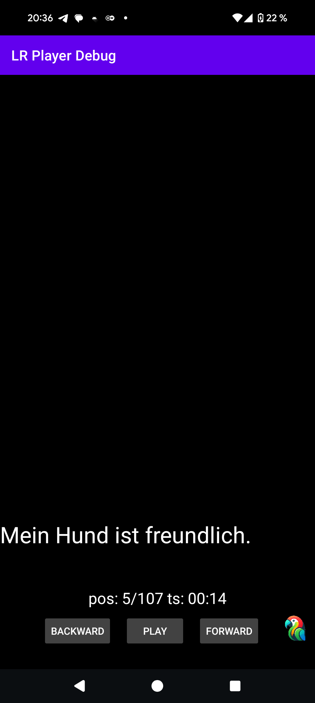
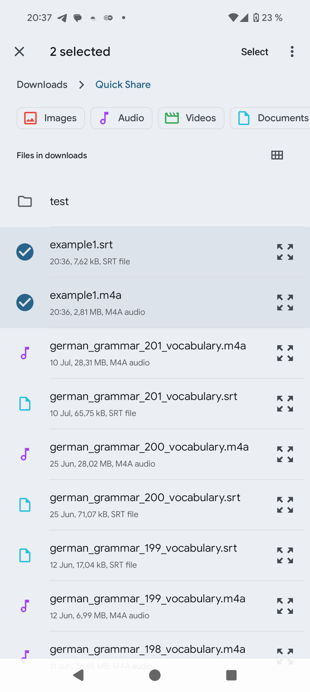
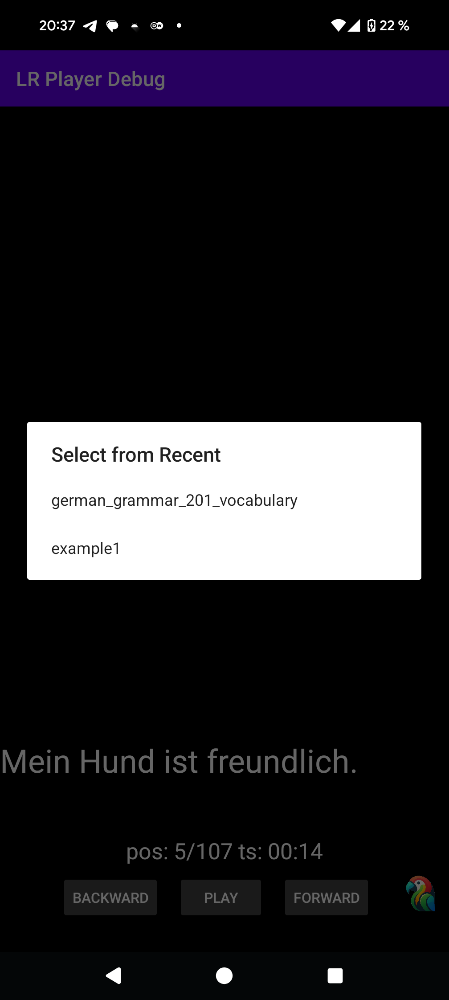

# LR Player

LR Player is an Android audio player designed as part of the LangRepeater German learning stack ([github.com/konstantin-eu/langrepeater](https://github.com/konstantin-eu/langrepeater)). It supports subtitles, rewinding/jumping to the next or previous subtitle, and background playback. This makes it easier to use LangRepeater-generated German learning materials.

## Build Steps
The app is built and tested using Android Studio.

## Supported Audio Format
The player supports audio files generated by the LangRepeater tool ([github.com/konstantin-eu/langrepeater](https://github.com/konstantin-eu/langrepeater)). The expected format is:

- **Stream 0**
    - Codec: MPEG AAC Audio (mp4a)
    - Type: Audio
    - Channels: Stereo
    - Sample rate: 22050 Hz
    - Bits per sample: 32

## App Screenshots
  
  

## Note on Code Generation
Parts of this project were programmed with the assistance of a large language model (LLM). As such, some code may not reflect standard best practices or optimal design choices. Contributions and improvements are welcome!

## Contact
Feel free to reach out!  
Email: [langrepeater@gmail.com](mailto:langrepeater@gmail.com)